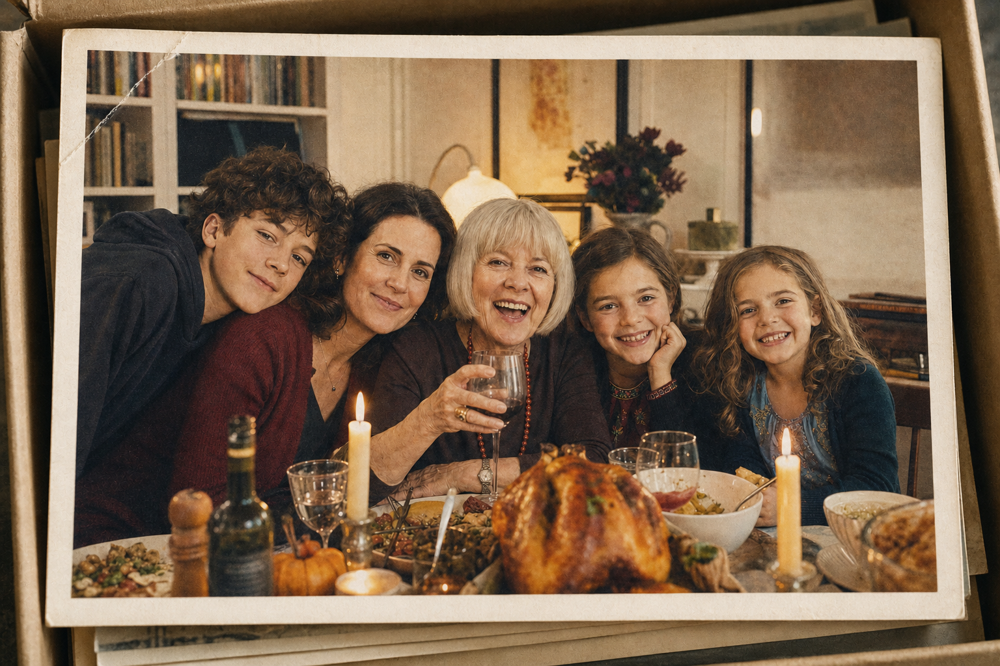

<div align="center">



# STILL

**After the funeral, a family opens the shoebox of photographs. Each one you pick up comes alive — a memory you stand inside.**

*for Marion, 1946–2026*

**▶ Play: https://still-inception-ii-six.vercel.app/?play=w_mt5nh92neea951dd** — one link, no keys, no setup; press **begin**.

*A submission to the Inception II: World Models Hackathon.*

</div>

---

STILL is a playable film built on a live world model. You sit with a family the
evening after the funeral — a real, navigable living room, generated in real
time, the house still full of mourners. Three photographs lie in a shoebox on
the coffee table. Pick one up and it scales to fill your screen while a world
model boots **from that same photograph** behind it — when it fades you are
standing inside the memory: the lake picnic in 1986, the bike lesson in 2022,
the Christmas kitchen. Walk around with WASD — you *are* someone in every
scene; on the bicycle, WASD pedals it. Put the photograph back and you're at
the table again, and Ellen — the daughter — says something new, **written at
that moment** for the photographs you've seen and the ones still waiting.

When the shoebox empties, the room itself becomes the album: a framed
photograph hangs above the piano, another stands on the bookshelf. The last
one — everyone, last Thanksgiving — ends the film.

## The experience, in one run

1. **▶ begin** — arms the film's sound (piano, ambience, voice).
2. The living room — a live world-model session, the family at the table,
   relatives in the doorway. Ellen speaks.
3. Three prints on the table. Pick one up → the photograph zooms → you stand
   **inside** it, a fresh session seeded from that exact image → put it back.
4. Every homecoming line is written live by an LLM from what you've seen and
   spoken in Ellen's designed fish.audio voice — different every playthrough.
5. The shoebox empties → the room becomes the deck: the 1978 lake photograph
   above the piano, then the Thanksgiving frame on the bookshelf — the last
   photograph. Putting it down ends the film on the album.

## Model stack

| Layer | Model |
| --- | --- |
| Every live world (the room + all five memories) | **lingbot-world-2** via Reactor — navigable, real-time, one session per photograph |
| All photographs (8 scene seeds + 5 card prints) | **gpt-image-2** — one anchor image of the family, every scene chained from it by edits for character continuity |
| Ellen's voice | **fish.audio** — a voice designed from a casting brief (`voice-design-1`), cloned, speaking every line in real time |
| Improvised dialogue | **OpenAI LLM** — the homecoming lines, written per playthrough from game state |
| Music | "Reminiscence" — Scott Holmes, CC-BY |
| Ambience | field recordings from Radio Aporee (CC) + a fish.audio-generated bed |

The world's own audio is deliberately muted; the soundtrack is layered and
ducked — ambience under piano under voice — so the film always sounds
authored, never hallucinated.

## What's in this repo

```
still/   the film: every scene prompt, line of dialogue, the cast (spec/story.json),
         and the fourteen build scripts that painted the photographs and pushed
         the world
app/     the playable thing — a fork of the Apache-2.0 Alakazam Studio world
         player. Our work: the story mode (title card, photograph deck, the
         one-motion zoom door, captioned narration with improvised returns,
         per-scene ambience), the STILL world record and its static seeds, and
         the deployment (serverless voice/LLM proxies, self-configuring
         bootstrap). Upstream's own README is kept at app/STUDIO.md.
```

## Run it

The deployed link above needs nothing. To run the same demo locally with your
own keys:

```sh
cd app
npm install
npx vercel dev        # serves the app + /api functions; put REACTOR_API_KEY,
                      # FISH_AUDIO_API_KEY, OPENAI_API_KEY in app/.env.local
```

Then open `http://localhost:3000/?play=w_mt5nh92neea951dd`.

To run the studio in plain dev mode (`npm run dev`) or re-author the world,
see `app/DEPLOY.md` and the scripts in `still/scripts/`.

## Credits

Made by Pras at the Inception II: World Models Hackathon. The engine is a fork
of [Alakazam Studio](https://github.com/Alakazam-studios/alakazam-studio)
(Apache-2.0) — see `app/STUDIO.md`. Music by Scott Holmes (CC-BY); ambience
from Radio Aporee (CC). All photographs generated with gpt-image-2; every
voice generated with fish.audio. Marion, 1946–2026 — never still, in any of
them.
