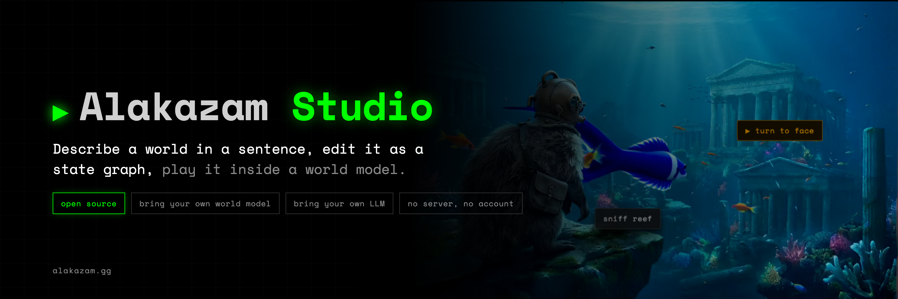
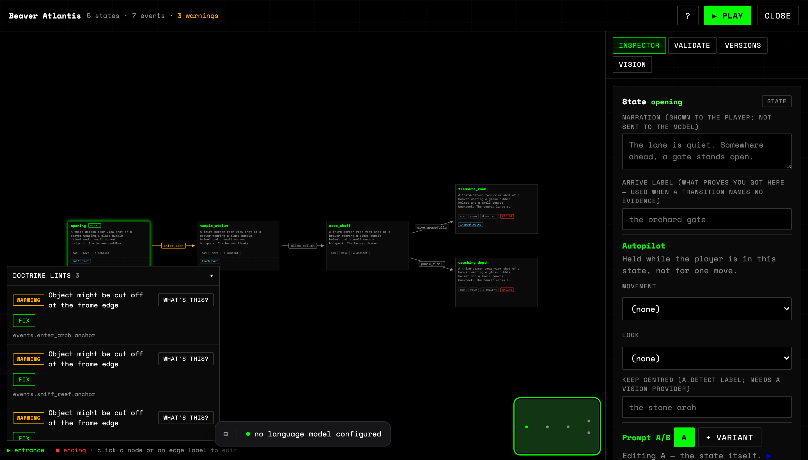
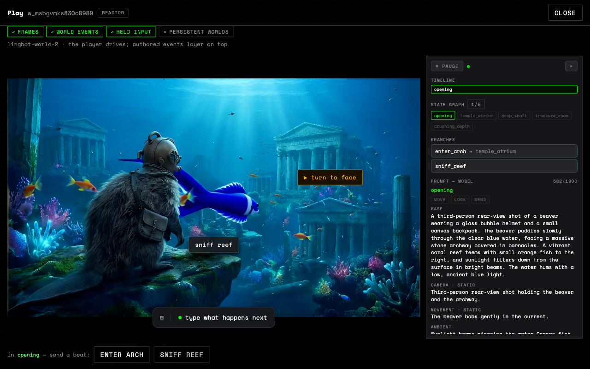

<div align="center">






### 👋 Welcome to Alakazam Studio | describe a world, edit it as a state graph, play it inside a world model.

**🗺 Contents – [🚀 Quick Start](#quick-start) · [🎬 What it is](#what-it-is) · [🔌 Providers](#providers) · [🔑 Keys](#keys) · [⌨️ CLI](#cli) · [🧱 Layout](#layout) · [🛠 Development](#development) · [📦 Install](#install)**

**📚 Documentation – [🔌 Provider setup](./docs/PROVIDERS.md) · [🔗 WebSocket protocol](./docs/WEBSOCKET_PROTOCOL.md) · [🤝 Contributing](./CONTRIBUTING.md)**

[](https://github.com/Alakazam-studios/alakazam-studio/actions/workflows/ci.yml) [](./LICENSE) [](./.nvmrc) [](./package.json)

<br />

</div>

# <a id="quick-start" href="#quick-start">🚀 Quick Start</a>

Node 22 or newer. Nothing else.

```sh
git clone https://github.com/Alakazam-studios/alakazam-studio
```

```sh
cd alakazam-studio
```

```sh
npm install
```

```sh
npm run dev
```

_**That's it! 🎉**_

The studio is at [localhost:4321](http://localhost:4321). No account, no key, no
`.env`. The world provider starts on `mock`, which runs offline, so nothing is
called until you configure something in Settings.

Add an LLM key to author worlds in plain language. Add a world-model key, or your
own WebSocket backend, to see generated video.

> **World-model inference is not in this repository.** There are no weights and no
> GPU code here. To see generated video you bring a backend: a Reactor key, your
> own WebSocket endpoint, or a hosted Alakazam key. Without one you stay on the
> offline mock, which draws your prompt, your current state and your events onto a
> canvas. The mock honours every authored beat, so the state machine is fully
> exercisable, but it is a stub and not a renderer.

# <a id="what-it-is" href="#what-it-is">🎬 What it is</a>

A world here is a small state machine. States hold the prompts that describe what
the world looks like right now. Events move between states when the player does
something. The studio is where you write that graph, version it, and push it into
a live world model to see what it looks like.

The studio is a static browser app. Three runtime dependencies: react, react-dom
and the Reactor SDK, which is code-split out of the main bundle and fetched only
if you pick that provider. No server of its own, no database, no account system.
Everything it talks to is something you point it at.

# <a id="providers" href="#providers">🔌 Providers</a>

Two independent choices. Mix them freely.

**World model** draws the world and reacts to it.

- `mock` runs offline with no key. The default.
- `reactor` uses your own Reactor key against api.reactor.inc.
- `websocket` connects to any endpoint speaking the protocol in
  [docs/WEBSOCKET_PROTOCOL.md](docs/WEBSOCKET_PROTOCOL.md).
- `alakazam` is the hosted path, for people who want it.

**LLM** writes and edits worlds from plain language. Any OpenAI-compatible
`/chat/completions` endpoint works. Presets ship for Cerebras, Groq, OpenAI,
OpenRouter, Ollama and LM Studio, plus a custom entry for vLLM, llama.cpp, TGI,
LiteLLM, or your own gateway. The two local ones need no key.

No LLM is active until you pick one. The dropdown starts on "none", so nothing is
selected and no endpoint fields are shown until you choose a preset. Ollama is
the one that needs no key, but nothing is called until you choose. Defaulting the
live provider to `localhost:11434` would greet everyone who is not already running
Ollama with a connection error, and an error on first launch reads as a broken app
rather than an unconfigured one.

Setup for each one, including where to get a credential and what breaks without
it, is in [docs/PROVIDERS.md](docs/PROVIDERS.md).

### What runs on what

| | mock | reactor | websocket | alakazam |
|---|---|---|---|---|
| Credential needed | none | your Reactor key | your endpoint (key optional) | Alakazam `sk_` key |
| Network | none | api.reactor.inc | your server | api.alakazam.gg |
| Generated video | no, canvas stub | opt-in, needs their SDK | depends on your server | yes |
| Authored events reach the picture | yes | yes | probed, see below | yes |
| Worlds persist server-side | no | no | if your server says so | yes |

Reactor streams out of the box. Its video rides a WebRTC transport only Reactor's
own SDK speaks, so that SDK is a dependency and `src/main.tsx` registers it at
boot. It is imported dynamically, so if you never select Reactor you never
download it. Delete that registration and the provider still loads. It reports
itself as not streaming, with a note saying why, instead of failing when you press
play. [docs/PROVIDERS.md](docs/PROVIDERS.md#reactor) covers swapping in your own
runtime.

Graph editing and versioning do not depend on this choice.

### Capabilities are probed, not assumed

Before a session starts, the studio asks the backend what it can do and shows the
answer in Settings. The field that matters most is `promptableEvents`, meaning the
backend accepts authored world events mid-session.

If a backend streams frames but cannot take authored events, your state machine
still runs. Transitions fire, the HUD updates, endings trigger, and the picture
ignores all of it. Nothing errors. You would sit there editing prompts that can
never reach the renderer. The studio therefore shows a standing warning whenever
`promptableEvents` is false, and you should believe it.

A probe that fails does not throw. It reports no capabilities and a note saying
why, so a bad URL or a rejected key shows up as text in Settings rather than a
console stack trace.

### Bring your own world model

If you have a model that produces frames, you can drive it from the studio without
writing any studio code. Implement the WebSocket protocol in
[docs/WEBSOCKET_PROTOCOL.md](docs/WEBSOCKET_PROTOCOL.md), which includes a runnable
echo server you can start in one command to watch the studio connect, probe
capabilities, and push events.

Declare `promptableEvents: false` if your backend cannot take authored events. The
studio will warn the user instead of leaving them confused.

That includes a model on the machine you are reading this on. The `websocket`
provider is the local path too — `ws://localhost:…` is just an address — so no
part of the studio has to change to play a world model off your own hardware.
Two bridges ship as examples: `examples/world-doom.py` runs an ONNX diffusion
model that generates every frame on the CPU at about 1.5 fps, and
`examples/world-mira.mjs` speaks to MIRA Mini on Apple silicon or CUDA.
[docs/PROVIDERS.md](docs/PROVIDERS.md#a-world-model-on-your-own-machine) has the
six things a local runtime owes the studio. No weights ship here, and none are
downloaded for you: you point a bridge at a directory you filled yourself.

# <a id="keys" href="#keys">🔑 Where keys live</a>

Keys are entered in Settings and stored in this browser's `localStorage`, under
`alakazam-studio:providers:v1`. Nothing else. A studio configured before this
refactor keeps working: the old `alakazam-studio:config:v1` entry is folded
forward on first load and left in place, so downgrading does not lose the key.

**No key is ever read from a `VITE_` environment variable.** Vite inlines those
into the JavaScript bundle at build time and ships them to every visitor, so a key
placed there is published rather than configured. `.env.example` carries endpoint
defaults only.

`localStorage` is readable by any script running on the page. That is an
acceptable trade for a studio you run on your own machine and a bad one for a
studio you put on the public internet. If you deploy this where strangers can load
it, put your own backend in front and never hand the browser a provider key.

To remove a key, clear the field in Settings and save. Settings also has a reset
that clears every provider setting, including the migrated legacy entry. If a key
was ever on a machine you do not control, rotate it at the provider as well.

# <a id="cli" href="#cli">⌨️ The studio from a terminal</a>

Every operation is a node in one tool tree, and the tree compiles to the CLI, to
its own help, and to a compact projection an agent can carry in a system prompt.
There is no second implementation: the CLI drives the same store the browser
does, through a file-backed driver.

```sh
npm run studio -- --help                     # the whole surface
npm run studio -- --compact-help             # the projection agents read
```

The tree, grouped. Every leaf below carries its own `--help` with the full
contract:

- `world`: list, get, create (`--example` or `--premise`; `--async` + `job` to
  poll a hosted generation), update, fork, delete, storage, export, import
  - `world version`: list, get, snapshot, rename, delete, diff, restore
- `author`: generate (the kernel, where one premise becomes a whole graph of states,
  beats, a branch and endings, authored by your own language model and checked
  against the doctrine, up to four self-correcting rounds), state
  add/update/delete, event add/update/delete, entrance, ops (a batch of graph
  operations in one revision), quest (author a MISSION from a frame: ordered
  objectives that may only be grounded on nouns the vision model actually
  VERIFIED in the picture, because an action on an undetectable object is an
  action a player can never take), compile (run a stagecraft PROGRAM, a world
  authored as TypeScript, through the whole doctrine and write it only if
  nothing failed; see `examples/walk-to-the-bench.sc.ts`, which is the world
  this studio ships, re-authored as a program and pinned byte-equal to it),
  validate (the fail-closed gate), lint (advisory, against the doctrine),
  candidate (show the exact prose ONE event of a program will stream — the
  player's own assembler, so what you read is what a session sends; `--variant
  dynamic` gives the travelling layers, which is the pair worth comparing when
  you are deciding between two phrasings),
  spine (lay a BOOK out as a macro-graph of acts before any of them is authored:
  two to six acts, the golden thread a reader would recognise, and the edges
  between them), chapter (paste a chapter of prose and get a world that follows ITS beats: one
  read finds what happens and in what order, a second finds what must look the
  same in every state, and the kernel authors the graph from both), book (the
  whole thing at once: lay out the acts, author every one of them through the
  chapter path, wire them into a campaign, and run the macro lints over the
  result)
- `provider`: list
- `docs`: the domain map, read live off each domain's own doc comment

```sh
npm run studio -- world create --example     # the worked example world
npm run studio -- world list
npm run studio -- author state add <world> --base "Rain on the lane." --id rain
npm run studio -- author event add <world> --from lane --to rain
npm run studio -- world export > worlds.json
```

Worlds live in `~/.alakazam-studio/worlds.json`; set `STUDIO_HOME` to move them.
`world export` and `world import` move them between that file and a browser.

Help is the spec: every command carries a one-line summary and a full contract,
and every flag documents itself. A mistyped read is corrected and run; a mistyped
write never is.

# <a id="layout" href="#layout">🧱 Project layout</a>

One concept, one directory, one public face. Every directory has an `index.ts`
whose doc comment states what it owns and what belongs elsewhere, and a caller
imports that face rather than reaching into another domain's files. Both rules
are enforced by `npm run check:conventions`, not by convention alone.

```
src/
  world/        what a world IS and where it lives
    types.ts      the world/state/event shapes
    api.ts        the hosted /v1 client
    store/        WorldStore: two implementations (local, remote), local backed by a file driver for the CLI
    tools.ts      world operations, as tools
  provider/     the swappable seam
    types.ts      the provider contract; world + LLM interfaces, capabilities
    registry.ts   which provider is active, and where config is persisted
    world/        one file per world-model provider
    llm/          OpenAI-compatible client and endpoint presets
  author/       making a world: create, graph editor, inspector, agent, versions
  play/         running one against a live world model
  studio/       the shell: app, context, URL state, API log
  account/      the hosted plan and usage
  theme/        the one component vocabulary, and the stylesheet
  tool/         the tool primitive: define, dispatch, help
bin/studio.ts   the CLI, running the same tools against the same store
examples/       a runnable reference world model (zero dependencies)
misc/           the README's imagery, regenerated by scripts/brand.mjs
docs/
  PROVIDERS.md            per-provider setup and credentials
  WEBSOCKET_PROTOCOL.md   the wire format for your own backend
```

Read `src/provider/types.ts` first. It documents the seam in more detail than
this file does, and the rest of the code implements it.

# <a id="development" href="#development">🛠 Development</a>

```sh
npm run check      # the gate: typecheck, conventions, unit, end-to-end
npm run dev        # vite dev server on :4321
npm run test:unit  # the tool tree and the CLI, against a real store on disk
npm run test:e2e   # the studio in a browser, with no key and no network
```

`npm run check` is what CI runs, verbatim. Do not bypass it; if it is broken,
fix it.

`npm run check:conventions -- --help` prints every rule, generated from the
registry that executes them, so the documentation cannot drift from the
enforcement. Rules that have existing violations carry a per-file budget that
may only ever go down.

TypeScript is strict, plus `noUncheckedIndexedAccess`,
`exactOptionalPropertyTypes` and `noPropertyAccessFromIndexSignature`. Code style
is 2-space indent, single quotes, no semicolons.

The pictures at the top of this file are regenerated, not hand-made:

```sh
npm run dev                    # the editor shot photographs a live browser
node scripts/brand.mjs         # writes misc/banner.png and misc/editor.png
```

# <a id="install" href="#install">📦 Install</a>

Two ways in. Take the first if you intend to read or change any of this, the
second if you would rather not install a toolchain.

### From source

Node 22 or newer, which is what `.nvmrc` and `engines` pin. Nothing else: no
native modules, no symlinks, no step that needs a POSIX shell.

```sh
git clone https://github.com/Alakazam-studios/alakazam-studio
cd alakazam-studio
npm install
npm run dev
```

Open <http://localhost:4321>. No account, no key, no `.env`. The world provider
starts on `mock`, which runs offline, so nothing is called until you configure
something in Settings.

The same four lines run on macOS, Linux and Windows. Exercised from clean
machines on Ubuntu 24.04 (Node 20.20.2) and Windows Server 2022 (Node 20.18.1),
before the Node 22 pin and before the Reactor SDK was a dependency:
`npm ci`, `tsc --noEmit` and `vite build` all pass, and the build serves.

### With Docker

```sh
git clone https://github.com/Alakazam-studios/alakazam-studio
cd alakazam-studio
docker compose up -d
```

Open <http://localhost:4321>. `docker compose down` stops it. The first run has
to build the image; after that it starts in about a second.

**Stop `npm run dev` first.** Both want port 4321, and the collision is silent on
macOS: Docker binds `0.0.0.0` while Vite holds `[::1]`, `docker compose ps` reports
the container healthy, and `http://localhost:4321` serves the dev server while
`http://127.0.0.1:4321` serves the container. Set `STUDIO_PORT` to run both.

One `docker-compose.yml` covers both jobs. The container you run on your laptop
is the one you would put on a server: a `node:22-alpine` stage (the version tracks
`.nvmrc`) installs the toolchain and produces `dist/`, a second stage copies those
files and nothing else (no `node_modules` in the shipped image) and serves them
as uid 1000 with a `HEALTHCHECK` against `/healthz`. Nothing secret is baked in,
because there is nothing secret to bake. Keys are entered in Settings and stay in
the browser.

For hot reload inside a container rather than on the host:

```sh
docker compose --profile dev up dev     # vite on http://localhost:4322
docker compose --profile dev down
```

Name the profile on the way down as well as on the way up. Without it Compose
leaves the dev container running and then fails to remove the network it is still
attached to, which reads as a broken teardown.

### Self-hosting

The build is static files.

```sh
npm run build      # typechecks, then writes dist/
npm run preview    # serves dist/ on http://localhost:4321
```

Copy `dist/` to any static host. There is no server component to run, no build-time
secret, and no origin the studio must be served from.

Three things to know about hosting a browser-only app that calls other people's
APIs.

**CORS is yours to solve.** Requests go from the visitor's browser straight to the
provider, so the provider has to allow your origin. The hosted vendors do, and
[docs/PROVIDERS.md](docs/PROVIDERS.md) records when that was last measured. Local
tools like Ollama and LM Studio need a setting flipped. A CORS rejection shows up
as a network failure with no response body, so if a provider works in `curl` and
fails in the studio, check the browser console before suspecting the key.

**A page served over `https://` cannot open a `ws://` socket.** The browser blocks
the upgrade and the socket never opens. Use `wss://` for a deployed studio, or
serve the studio over `http://localhost` while you develop.

**The play iframe needs its own headers.** The hosted runtime is loaded
cross-origin in an `<iframe>` and carries its own COOP and COEP for the
cross-origin isolation it needs. Do not set
`Cross-Origin-Embedder-Policy: require-corp` on the host serving the studio. Doing
so blocks the iframe and any cross-origin cover image, and the failure reads as
`ERR_BLOCKED_BY_RESPONSE`.

### Ports and build-time addresses

| variable | default | effect |
|---|---|---|
| `STUDIO_PORT` | `4321` | host port for the built studio |
| `STUDIO_DEV_PORT` | `4322` | host port for the `dev` profile |
| `VITE_ALAKAZAM_API_BASE` | `https://api.alakazam.gg` | address of the hosted `/v1` API |
| `VITE_ALAKAZAM_EMBED_HOST` | `https://play.alakazam.gg` | address the player iframe loads from |

Set them in a `.env` file beside `docker-compose.yml`, or export them before
building. The two `VITE_` entries are addresses and only addresses: Vite inlines
them into the JavaScript bundle at build time, so anything put there is published
to every visitor rather than configured. The default `mock` provider uses
neither.

To serve a build without Docker and without adding a dependency:

```sh
npm run build
node scripts/serve.mjs dist    # PORT and HOST are honoured
```

That script is the same one the container runs. It is Node's standard library
only, which is what keeps the image's dependency count at zero.

### Platform requirements

Node 22 or newer, and a browser. The toolchain is Vite and TypeScript, there are
no native modules to compile, and the build has no platform-specific steps, so
the same `npm ci && npm run build` is expected to work everywhere.

Verified by hand on a clean machine: **Ubuntu 24.04** (`npm ci` 3s, build 7s) and
**Windows Server 2022** (`npm ci` 20s, build 13s), both serving afterwards. macOS
is developed on daily but has never been tried on a *clean* Mac, so read that one
as expected rather than verified. [`.github/workflows/ci.yml`](.github/workflows/ci.yml)
runs all three on every pull request and tag.

# <a id="contributing" href="#contributing">🤝 Contributing</a>

Contributions are welcome. [CONTRIBUTING.md](./CONTRIBUTING.md) is short and it is
the whole deal: one gate (`npm run check`), one house style, and an explanation of
why the conventions are executable rather than written down. By taking part you
agree to the [Code of Conduct](./CODE_OF_CONDUCT.md).

# <a id="license" href="#license">📄 License</a>

Apache-2.0. See [LICENSE](LICENSE) and [NOTICE](NOTICE). No provider credentials,
model weights, or provider code are included here. What you generate with your own
credentials is governed by your agreement with that provider.
